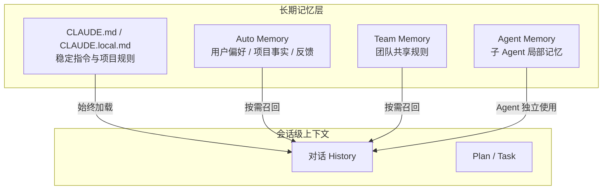
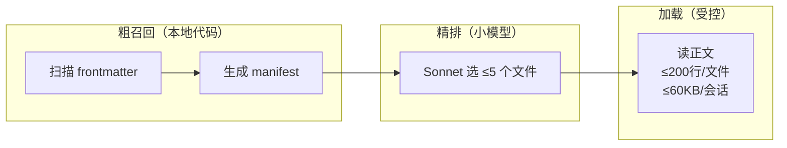
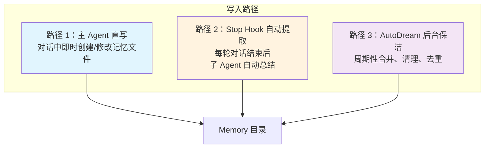
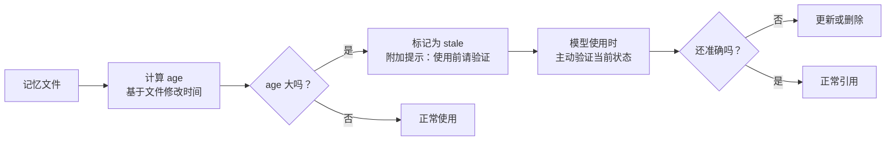
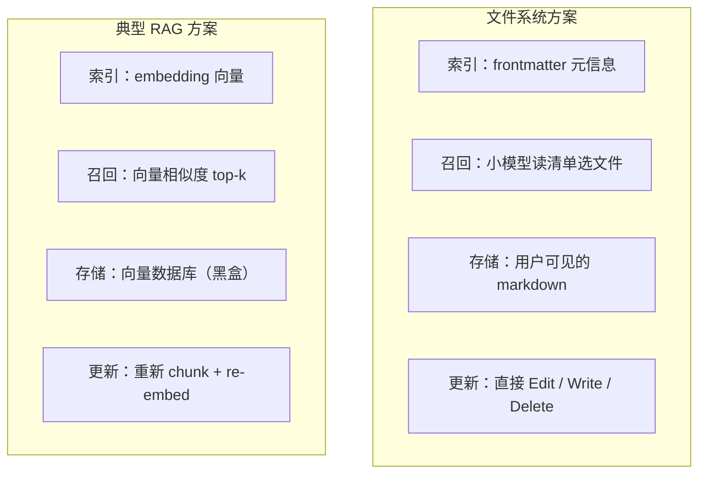

## 引言：为什么 Agent 需要长期记忆？

大模型的对话 history 解决的是"这次聊天记住上文"，但当一个 AI Agent 需要跨会话、长周期地协助你工作时，仅靠 history 远远不够。你不会希望每次打开 Claude Code 都要重新告诉它"我喜欢怎样的测试风格"、"项目当前在做什么"、"上次我们发现的坑是什么"。

这就是 Agent 长期记忆要解决的问题：**让 Agent 在多次会话之间保持对用户、项目和工作习惯的持续理解。**

但"记住"只是第一步，更难的问题是：
- 记什么？不是所有对话都值得记。
- 怎么找？记忆多了之后，如何快速定位相关的那几条？
- 怎么维护？信息会过时，旧记忆可能变成误导。

Claude Code 给出了一个有意思的答案：不用向量数据库，不做 RAG，而是把记忆做成文件系统上的 markdown 文件，用小模型来判断相关性。这套方案背后的设计思路，值得每一个在做 Agent 记忆系统的人参考。

## 架构总览：四层记忆体系

Claude Code 的记忆不是一个单一的存储，而是按职责分成了四层：



**为什么要分层？** 因为不同类型的信息有不同的生命周期和使用范围：

| 层级 | 内容 | 生命周期 | 范围 |
|---|---|---|---|
| CLAUDE.md | 项目规则、编码规范 | 长期稳定 | 所有会话 |
| Auto Memory | 用户偏好、项目阶段、反馈 | 中期，需维护 | 按需召回 |
| Team Memory | 团队共享的规则和事实 | 中期 | 团队共享 |
| Agent Memory | 子 Agent 的工作习惯 | 短-中期 | 特定 Agent |

如果把这些全混在一起，模型很难判断哪些是长期稳定的规则、哪些是临时的项目状态。分层让每一层的更新频率和管理策略可以独立演进。

## 存储设计：索引 + 文档集合

Auto Memory 的存储结构非常简单——就是文件系统上的一个目录：

```
~/.claude/projects/<project>/memory/
├── MEMORY.md              # 索引文件（只放指针，不放正文）
├── user_role.md           # 用户角色信息
├── feedback_testing.md    # 测试偏好反馈
├── project_deploy.md      # 部署流程记录
└── team/
    └── code_style.md      # 团队编码风格
```

每个记忆文件用 YAML frontmatter 标注元信息：

```yaml
---
name: Testing Preferences
description: User prefers focused assertions over snapshot tests
type: feedback
---
```

这里最关键的是 `description` 字段——它是召回时的主要依据。可以说，**一条记忆的 description 写得好不好，直接决定了它能不能被找到**。

`MEMORY.md` 只做索引，每行一个指针：

```markdown
- [Testing Preferences](feedback_testing.md) — 测试风格偏好
- [Deploy Flow](project_deploy.md) — 生产部署走 release 分支
```

这个设计看似简单，但有一个重要的隐含选择：**它不是树状知识图谱**。虽然物理上可以用子目录组织，但逻辑上所有记忆文件是一个扁平的候选集合，召回时不会按层级推理。

## 召回机制：frontmatter 清单 + 小模型判断

这是整套设计中最精巧的部分。Claude Code 没有用向量检索，而是设计了一个四步召回流程：


### 第一步：扫描 header，不读全文

遍历 memory 目录下所有 `.md` 文件，但每个文件只读前 30 行，从中解析 frontmatter。这一步的产出是一份轻量候选表，包含文件名、路径、修改时间、description 和 type。

### 第二步：格式化为 manifest

把候选表转成一行式清单：

```
- [feedback] testing_gotcha.md (2026-03-28): User hates snapshot-heavy tests
- [project] deploy_flow.md (2026-03-20): Production deploys go through release branch
```

这一步的关键在于：**它把"在所有记忆中搜索"转化成了"从候选清单里选文件"**。

### 第三步：小模型挑文件

将当前用户的问题、manifest 清单、最近使用的工具，一起发给 Sonnet 模型，让它返回最相关的文件列表（最多 5 个）。

这不是语义相似度计算，而是让模型做一次**理解性判断**——它能处理"我在调试部署问题" → 应该召回 `deploy_flow.md` 这种需要推理的关联。

### 第四步：读取正文

只有被选中的文件才会被完整读取，并且有严格的容量限制：

- 单文件：≤ 200 行，≤ 4KB
- 整个会话累计：≤ 60KB

超长内容会被截断，并提示模型按需使用文件读取工具获取完整内容。



这套两阶段召回——本地代码做粗召回、小模型做精排——是一个非常实用的折中方案。

## 写入与维护：三条路径

记忆的写入不是单一入口，而是有三条路径分工协作：



### 路径 1：主 Agent 直写

在对话过程中，Agent 可以直接创建、修改、删除记忆文件。这是最即时的写入方式，通常在用户明确要求"记住这个"时触发。

### 路径 2：Stop Hook 自动提取

每轮对话结束后，系统会 fork 一个子 Agent 来审视这轮对话，判断是否有值得长期保留的信息。这个子 Agent 有一个重要的权限约束：**它可以读取项目文件，但只能在 memory 目录内写入**。而且如果主 Agent 这一轮已经写过 memory，它会自动跳过，避免双写冲突。

### 路径 3：AutoDream 后台保洁

这是一个周期性的维护机制，触发条件是：
- 距上次整理至少 24 小时
- 期间至少有 5 次新会话

它会在后台 fork 子 Agent，执行合并重复内容、清理过时记忆、修正错误指针等维护性操作。这不是"写新记忆"，而是"打扫和重组现有记忆"。

这三条路径体现了一个重要的设计原则：**即时写入和后台维护分离**。即时写入保证响应速度，后台维护保证记忆质量，两者互不干扰。

## 过期策略：没有 TTL，只有 Staleness 管理

Claude Code 的记忆没有硬过期时间。它采用了一种更柔性的策略：



核心思路是：**让记忆越老越"可疑"，但不自动删除，而是通过验证和维护来纠偏。**

这比硬 TTL 更适合 Agent 场景，因为：
- 有些信息天然长寿（"用户是后端工程师"），设 TTL 会误删
- 有些信息衰减很快（"当前在做 v2.0 迁移"），但衰减速度不可预测
- 让模型在使用时判断"这条还对不对"，比预设一个固定过期时间更灵活

## 为什么不用 RAG？

理解了上面的设计后，我们可以回答一个关键问题：Claude Code 为什么选择文件系统而不是向量检索？



核心判断是：**Claude Code 把记忆当成 Agent 工作空间的一部分，而不是独立的检索系统。**

### 可编辑性是 Agent 记忆的刚需

Agent 的记忆天然需要持续修正：用户纠正了偏好、项目阶段变了、旧结论过时了。文件系统方案下，改一行 markdown 就完成了。RAG 方案要做同样的事，需要定位原 chunk → 删除旧向量 → 重新 chunk → re-embed → 写回，这个链路在 Agent 自主操作时非常脆弱。

### 工具复用优于专用基础设施

Claude Code 已经有 Read / Write / Edit / Grep / Glob 这套文件操作工具。记忆做成文件后，不需要引入任何新工具，Agent 用操作代码的同一套能力就能操作记忆。RAG 方案则需要额外的 `vector_search`、`vector_upsert` 工具，增加了模型选错工具的概率。

### 召回精度的可控性不同

RAG 的召回精度取决于 embedding 质量和 chunk 策略，用户基本不可控。而文件系统方案的召回精度取决于 description 写得好不好——这是用户可以直接优化的。而且小模型做判断比纯向量余弦相似度多了一层"理解"，能处理需要语义推理的关联。

### 代价

这套方案也有明显的天花板：
- **规模受限**：记忆文件多到几百个时，manifest 本身就很长，小模型选择质量会下降
- **依赖 description**：写得模糊的记忆基本等于不存在
- **缺乏模糊匹配**：向量检索天然支持近义词、跨语言匹配，frontmatter 扫描做不到

当记忆规模适中（几十到上百条）且需要频繁修正时，文件系统方案是更优解。但如果记忆上千、大部分只读，RAG 会更合适。

## 设计启示：Agent 记忆系统的通用原则

从 Claude Code 的实践中，可以提炼出几条适用于更广泛 Agent 记忆系统的设计原则：

### 原则 1：记忆应该是可见、可编辑、可审计的

把记忆做成用户能直接看到和修改的格式，而不是锁在黑盒里。这不仅是透明性的问题——当 Agent 的行为出了问题，用户能直接检查"它到底记住了什么"，这对建立信任至关重要。

### 原则 2：分层存储，按生命周期管理

不同类型的信息（稳定规则、阶段事实、个人偏好、临时上下文）应该放在不同的层，用不同的策略管理。全混在一起会导致模型难以判断优先级。

### 原则 3：两阶段召回——粗筛 + 精排

先用低成本的方式筛出候选集，再用更智能的方式精排。这比一步到位的全文检索更可控、更经济。Claude Code 用文件扫描 + 小模型做到了这一点，但其他方案也可以用不同的技术组合实现同样的思路。

### 原则 4：写入和维护分离

即时写入保证响应速度，后台维护保证记忆质量。自动提取应该有严格的权限约束，避免副作用扩散。多个写入路径之间需要防冲突机制。

### 原则 5：柔性过期优于硬 TTL

不要用固定时间自动删除记忆，而是让旧记忆越来越"可疑"，要求 Agent 在使用前验证。这更符合现实世界中信息衰减的模式——有些事实三天就过时，有些十年不变，预设 TTL 无法兼顾。

### 原则 6：最危险的不是遗忘，而是错误的确信

Agent 记忆系统最大的风险不是"没记住该记的"，而是"把过时的信息当成当前事实"。所有的设计——staleness 提示、使用前验证、后台清理——本质上都在防御这一点。

## 总结

Claude Code 的记忆体系展示了一种 Agent-Native 的长期记忆设计思路：不追求黑盒召回的极致精度，而是在可解释性、可编辑性、低成本和工具兼容性之间找到了一个工程上的最优平衡。

它更像是给 Agent 配了一本可以随时翻阅和修改的笔记本，而不是一个自动运转的知识库。这种设计哲学对任何在构建 Agent 系统的团队都有参考价值——有时候，最好的记忆系统不是技术上最先进的，而是最适合 Agent 工作方式的。
